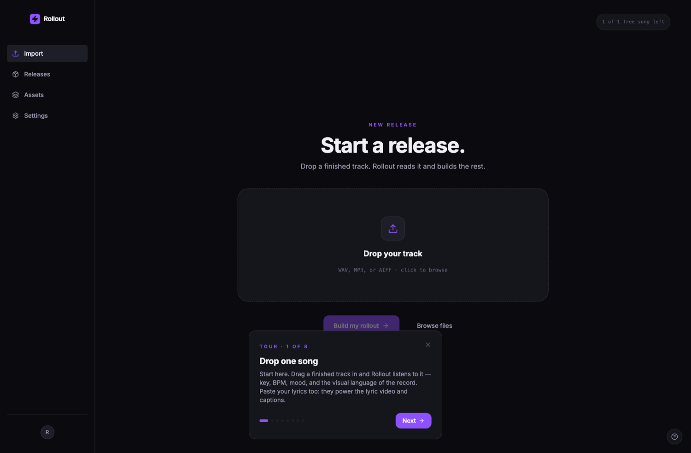
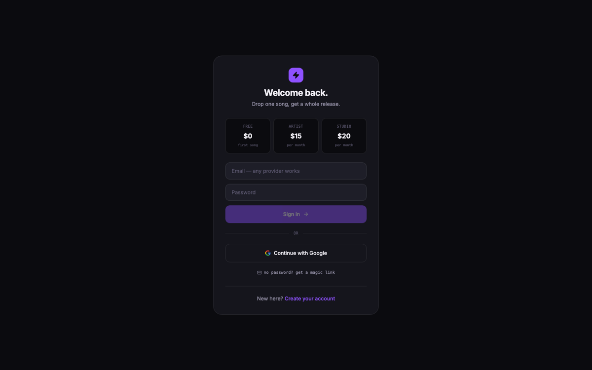

# Rollout

**Drop one song, get a whole release.**

An independent artist uploads a finished track. Rollout listens to it, then builds the
release kit around what it actually hears: layered cover art, a distributor hand-off, a
release calendar with captions that quote the real lyrics, a beat-synced lyric video, a
fan page the artist owns, and an ad center pointed at that page instead of at a streaming
platform that keeps the fan data.

Multi-tenant SaaS. React 19 + TypeScript frontend, FastAPI + Python ML engine, Supabase
Postgres with row-level security, Stripe subscriptions with server-enforced plan gating.

A Th3Circle product.



*The entry point. Note the counter top right: `1 of 1 free song left`. The client renders
that number, but it does not decide it — the limit is enforced in Postgres, which is the
subject of the section below on metering.*

---

## The parts that were actually hard

Most of this app is ordinary product work. These five are the parts worth reading.

### 1. Making a model hear a song the way its artist does

The vibe engine (`backend/vibe.py`) is zero-shot audio classification on
[LAION-CLAP](https://github.com/LAION-AI/CLAP), and the naive version of it is unusable.
Five things fixed that:

- **Music-trained checkpoint.** The general 630k checkpoint hears *audio events*. Swapping
  to `music_audioset_epoch_15` (HTSAT-base) made it hear musical mood.
- **Prompt ensembles.** Every mood label is scored as the mean of three phrasings, so a
  wording quirk in one prompt stops deciding the answer.
- **Z-score calibration.** Raw CLAP similarities are biased per prompt and not comparable
  across labels. Normalizing across the label set makes the ranking mean something.
- **Five-window listening.** Intro, verse, hook, late, and outro are each embedded and
  averaged, so the whole song votes instead of the first ten seconds.
- **Theory and lyrics fusion.** Detected key and tempo apply small z-score nudges (minor
  key leans emotional and introspective, sub-85 BPM leans mellow), and pasted lyrics are
  embedded into the same space to break ties. The ear leads, theory advises.

There is also a **skepticism prior**: presentation-risky labels carry a negative bias, so
they have to strongly dominate before they surface. That exists because an artist told me
the model called his self-discovery song "romantic," which was defensible from the audio
and completely wrong for how he would market it. Being confidently wrong in a user's face
is worse than being vague.

Licensing note: LAION-CLAP is openly licensed. Essentia's mood models are more accurate
out of the box but are CC BY-NC-ND, so they cannot ship inside a paid product. That
constraint picked the architecture.

### 2. Lyric timing that survives a mishearing

Speech-to-text on a full mix produces garbage, and even on an isolated vocal it mishears.
`backend/align.py` treats the transcript as a *locator*, not as truth:

1. **demucs** separates the vocal stem from the mix.
2. **stable-ts** transcribes that stem to find roughly what is sung and when.
3. The transcript is **fuzzy-matched** against the artist's own pasted lyrics (`difflib`)
   to locate the correct passage.
4. The **true lyrics** are then force-aligned to the vocal for word-level timestamps.

The artist's text always wins. The model only decides *when*, never *what*. On an
instrumental it returns zero words instead of hallucinating, which is the behavior that
actually matters.

### 3. One rendering engine for preview and export

`src/compositor.ts` is an Illustrator-style layer stack rendered to canvas: AI base image,
cut-out subject, color wash, procedural texture, light, typography. The 840px preview and
the 3000px export call the **same function** with a different size argument, so what you
see is what ships. Textures scale with output size so grain reads identically at both
resolutions.

This exists because a flat AI image looks like a flat AI image. A composite built from
separable layers is a designed artifact, and it does not carry the uniform statistics that
make generated images obvious.

### 4. Metering the client cannot lie about

Free-tier limits are enforced in the database, not the browser.
`supabase/002_metering_fix.sql` and `003_tiers.sql` use `security definer` functions plus a
trigger that blocks writes to privileged columns unless the transaction is marked internal
or carries the service role. A client can call anything it likes and still cannot grant
itself a plan or reset its own usage counter.

Same lesson as Th3Circle, where I found that row-level security gates *rows* but not
*columns*, and closed it with a layered fix: RLS policies, an API-level column allowlist,
and a database trigger.



The three tiers a session can hold. Which one you are on is a column the browser can read
and cannot write: the trigger rejects the update even when the request carries a valid
session for that exact row. The sign-in screen is the only place a tier is chosen, and the
choice is settled server side.

<br clear="right">

### 5. A red-team loop that improves itself

Every server endpoint takes untrusted input, and a few of them fetch URLs, run
subprocesses, and decode user images. So the app is hardened by a repeatable
**two-legged red-team loop**, documented in [`REDTEAM.md`](REDTEAM.md):

- **Static leg** — every changed file is read line by line against a growing
  checklist (SSRF, resource exhaustion, billing races, error handling).
- **Runtime leg** — two adversarial suites run for real: a backend suite of
  ~48 cases (SSRF to metadata IPs, path traversal, injection, malformed bodies,
  concurrency) and a headless-browser suite that loads every page and fails on an
  uncaught error or an own-backend 4xx.

The loop's rule is that it **learns**: when a pass finds a new bug class, a
checklist item and a test are added, so the next pass is sharper than the last.
It runs until two consecutive rounds find nothing new. Three things it produced:

- **SSRF-safe fetch** (`backend/netguard.py`). Every fetch of a user-influenced
  URL resolves the host once, rejects private / loopback / link-local / cloud-
  metadata / CGNAT addresses (including Alibaba's `100.100.100.200`), then
  connects to that **pinned IP** so DNS can't rebind between the check and the
  request. Redirects are refused, responses are size-capped, ports are allow-listed.
- **A Stripe webhook that survives out-of-order delivery.** Stripe delivers
  at-least-once and can reorder events, so a redelivered "subscription active"
  arriving after a cancellation would re-grant a paid plan. Every plan write is an
  **atomic compare-and-set** against a per-row high-water mark (`stripe_event_ts`),
  so an older event can never overwrite a newer one, even under a delivery race.
- **Bounded resources.** Every subprocess and fetch has a timeout, every temp
  directory is cleaned in a `finally`, uploads are swept on a schedule and capped
  at the stream level (not just a trusted `Content-Length`), and image decoding
  has a decompression-bomb ceiling.

---

## Cost architecture

Built-in AI has to cost the operator nothing, so the image gateway (`backend/genimage.py`)
fronts ten providers behind one interface:

| Tier | Providers |
|---|---|
| Free, no key at all | Pollinations, AI Horde |
| Free tier, free key | Google Gemini, Hugging Face, Cloudflare Workers AI |
| Bring your own account | Together, Replicate, Stability, OpenAI, any OpenAI-compatible endpoint |
| Platform credits | fal.ai behind our key, so the artist never touches an API key |

User keys are passed per request and never stored. Any provider failure falls back to the
free built-in engine rather than erroring out someone's release.

---

## Stack

```
Frontend    React 19, TypeScript, Vite, Tailwind, canvas compositor
Engine      Python, FastAPI, librosa, LAION-CLAP, demucs, stable-ts, Pillow
Video       Remotion (programmatic React video)
Data        Supabase Postgres, row-level security, security-definer RPCs
Payments    Stripe subscriptions, webhook via Supabase Edge Function
```

## Structure

```
src/               React frontend, one screen per lifecycle step
  pages/           Import · Build · Dashboard · Cover · Distribute · Plan ·
                   Lyrics · Landing · Ads · Ship · Settings
  compositor.ts    layer engine (preview and export share it)
  store.tsx        session, release state, cloud sync, plan gating
backend/
  server.py        API surface
  netguard.py      SSRF-safe, IP-pinned outbound fetch (shared by every URL fetch)
  vibe.py          CLAP mood + genre, calibrated
  analyze.py       key / BPM / duration / visual keywords (librosa)
  align.py         demucs + stable-ts forced alignment
  lyricvideo.py    hook detection and render pipelines
  artdirection.py  album-cover design knowledge, style archetypes
  genimage.py      ten-provider image gateway
  captions.py      release captions built from the real vibe
video/             Remotion lyric-video composition
supabase/          schema, RLS, metering, tiers, Stripe webhook
tools/             premium-check.mjs, a strict design-system grader
docs/              architecture and completeness specs
REDTEAM.md         the self-improving red-team checklist + round log
DEPLOY.md          ordered go-live checklist
```

## Running it

```bash
./start.sh              # engine + app together
npm run dev             # frontend only
npm run premium         # design grader, fails below 95/100
cd backend && uvicorn server:app --port 8000
```

The engine needs a Python 3.11 environment with librosa, demucs, stable-ts, rembg, and
laion-clap. First run downloads the CLAP checkpoint, roughly 2 GB.

## Quality gates

- `npm run premium` enforces the design contract and fails the build below 95/100
- `?page=Cover&autotest=composite` runs the image pipeline end to end and renders the
  flattened composite for inspection
- `docs/COMPLETENESS-SPEC.md` is the app-furniture checklist (history, empty states,
  onboarding, a11y, meta)
- `REDTEAM.md` documents the adversarial loop; its two runtime suites drive the backend
  to a green board (~48 cases) and load every page headless with zero uncaught errors

## Design contract

Flat `#0B0B0F`, violet `#8B5CF6` as the only action accent, amber `#F0A45B` for AI
signals, mint `#46E0A8` for ready states, monospace for data. Color is a signal, not
decoration. The enforced rules live in `tools/premium-check.mjs`.

---

## Status

The full lifecycle runs end to end: real audio analysis, real cover generation and
compositing, real forced-aligned lyric videos, real captions, multi-tenant auth, and Stripe
subscriptions with server-side plan enforcement.

Hardened and green. The red-team loop (`REDTEAM.md`) has converged — two consecutive clean
static rounds on top of green runtime suites (backend 48/48, every page rendering clean).
Go-live is gated only on payment-processor clearance and standing up the engine host; the
ordered steps are in `DEPLOY.md`.

Built and maintained by [Harrison C. Songolo](https://xkaii.studio).
