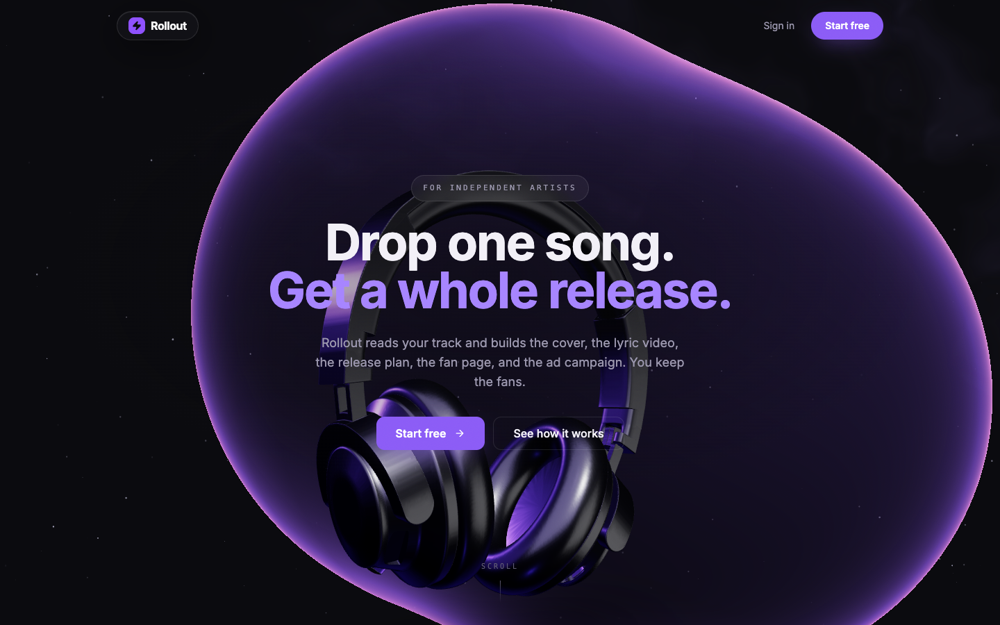
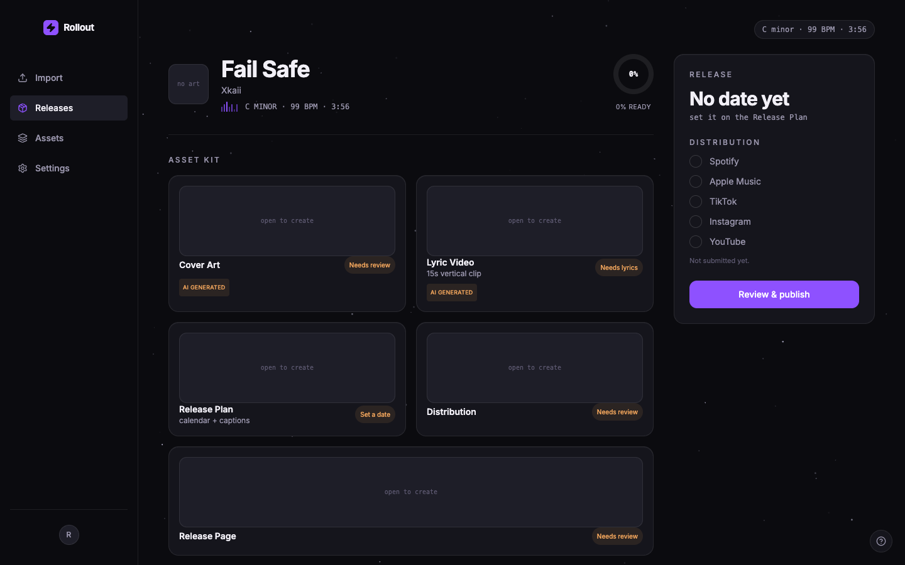

# I built a real-time 3D studio site, then I attacked it

A case study on shipping something that looks like a high-budget trailer **and**
holds up when someone probes it.



## The build

The visual layer is hand-written WebGL and GLSL, not a template or a page
builder. A raymarched glass "blob" that morphs and reacts to the cursor, a real
3D headphones model lit and graded in-scene, a drifting smoke shader, a
star field with shooting stars, and cinematic scroll transitions. The whole hero
runs in a **single WebGL context** on purpose: an earlier version split the blob,
the smoke, and the 3D into separate WebGL canvases, and on some GPUs the browser
evicted the extra contexts and repainted the hero solid white. Collapsing it to
one context fixed that class of bug for good.

The same atmosphere carries through the login screen and every screen of the
studio app behind it.



## Looking expensive is only half the job

Behind a site like this is a real product: a multi-tenant SaaS with Stripe
billing and PostgreSQL row-level security. So the question isn't "does it look
good," it's "does it hold up when someone pokes it." To answer that I wrote an
automated **red-team loop** and ran it against my own live stack: attack, triage,
patch, verify, then re-run until it comes back clean twice in a row.

It's two legs plus a memory file:

- **Static** — read every changed file line by line against a security /
  resource / correctness / billing checklist, then re-review the previous round's
  fixes (fixes have their own bugs).
- **Runtime** — automated adversarial suites that actually hit the running system.

## What it flagged

Mostly hardening, but the kind that bites you in production:

| Finding | Fix |
|---|---|
| **SSRF** on the server-side image fetchers (cover art, lyric video). The guard resolved the host, then the client re-resolved and connected — a DNS-rebinding window that could be aimed at cloud metadata, including the CGNAT range Python's `ipaddress` doesn't flag as private. | Pin the resolved IP and dial that exact IP, so the check and the fetch can't disagree. Shared `netguard` fetcher; every user-URL fetch routes through it. |
| **Row-level-security gap.** The trigger protecting the privileged columns (`plan`, the Stripe ids) fired on `UPDATE` but not `INSERT`, so a fresh row could be self-inserted with the paid tier already set. | Fire the trigger on `INSERT` too. |
| **Stripe webhook ordering.** Stripe redelivers and reorders events; the handler trusted arrival order, so a late or duplicate `subscription.updated` could re-grant a cancelled plan. | Per-row high-water mark (`stripe_event_ts`) enforced in the UPDATE's `WHERE` — an older event can't overwrite a newer one, and the guard is race-safe. |
| **Resource exhaustion.** A temp-dir leak in the audio-separation step, and a body-size cap that a chunked upload slipped past. | `finally` cleanup + periodic sweep; enforce the size cap on the byte stream, not the `Content-Length` header. |

## The two gaps the loop itself had

Running the loop taught me where it was blind, so I closed those too:

1. **The billing logic was only ever *read*.** Now the Stripe ordering lives in a
   pure module with a Node test that **replays reordered, duplicated, and
   same-second events** against a mock DB and asserts the final plan. 7 scenarios,
   including the race.
2. **The frontend check went green on a white page.** It only watched for console
   errors, which say nothing about pixels. Now a screenshot **flat-frame
   detector** fails if the rendered frame is one flat color, over the studio
   routes *and* the real landing. It's self-tested against synthetic white and
   black frames so it can't quietly lose its teeth.

And a **verified-feature tripwire**: 11 invariants that fail the build if I ever
delete something already built and verified, or reintroduce a mistake I already
fixed. Iterating on a live 3D site, the hardest part is not breaking the thing
that already worked.

## Outcome

One command runs every leg and prints one verdict:

```
PASS  build+typecheck
PASS  design:studio        PASS  design:marketing
PASS  verified tripwire
PASS  webhook ordering     (7/7 scenarios)
PASS  backend adversarial  (61 cases, 15/15 endpoint coverage)
PASS  visual render        (studio + real landing, not white)
== GREEN ==
```

The tripwire and the webhook test run in CI on every push. The loop converged
after re-reviewing its own fixes across six rounds; it found the gaps, I fixed
them, and it came back clean.

**Live:** [xkaii.studio](https://xkaii.studio) · **Security:** xkaii.studio/security
